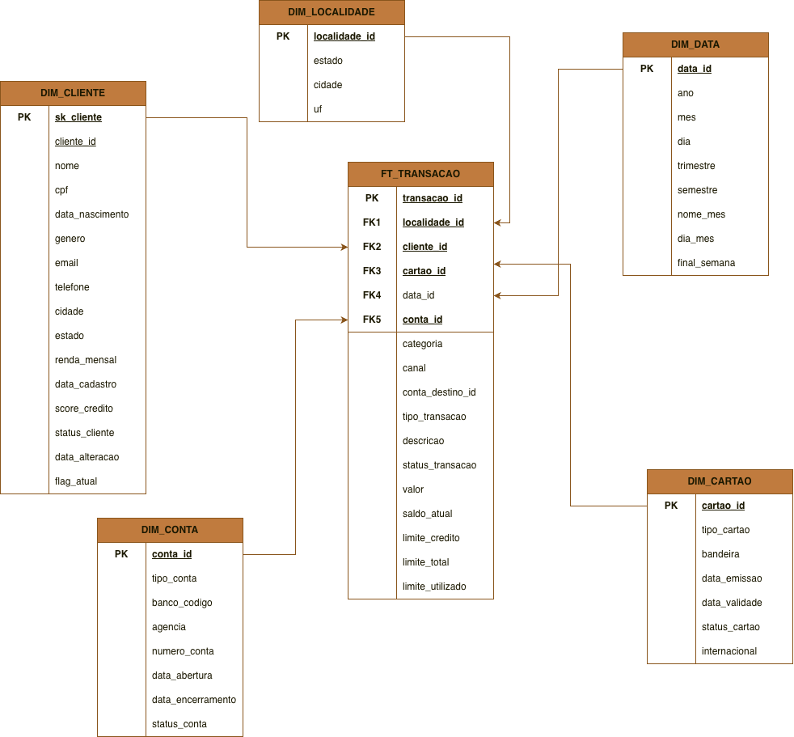

# pipeline_delta_s3
Pipeline de dados end-to-end construída localmente com arquitetura medallion (Landing → Bronze → Silver → Gold), orquestrada pelo Apache Airflow e com CI/CD via GitHub Actions.

---

## Visão geral
 
Este projeto simula um ambiente de engenharia de dados de produção rodando inteiramente em local. Os dados passam por camadas progressivas de refinamento — da ingestão bruta até modelos analíticos prontos para consumo — com qualidade de dados validada entre as camadas Silver e Gold.
 
---
 
## Arquitetura
 
```
Data Source (Parquet / CSV / JSON)
        │
        ▼
    boto3 (ingestão para S3)
        │
        ▼
┌─────────────────────────────────┐
│          PySpark (ELT)          │
│                                 │
│  Landing ──► Bronze ──► Silver  │
│  (Delta)    (Delta)    (Delta)  │
│                        SCD II   │
└─────────────────────────────────┘
        │
        ▼
  Great Expectations (Data Quality)
        │
        ▼
┌──────────────────────┐
│         Gold         │
│   DuckDB  +  dbt     │
└──────────────────────┘
 
Orquestração: Apache Airflow
Governança:   DataHub
CI/CD:        GitHub Actions
```
 
---
 
## Stack de tecnologias
 
| Camada | Tecnologia | Função |
|---|---|---|
| Ingestão | `boto3` | Upload de arquivos para S3 |
| Armazenamento | Amazon S3 | Data lake object storage |
| Formato | Delta Lake | Versionamento e ACID nas camadas |
| Transformação | PySpark | ELT Landing → Bronze → Silver |
| Historização | SCD Type II | Controle de histórico na Silver |
| Qualidade | Great Expectations | Validação entre Silver e Gold |
| Modelagem | dbt-core + DuckDB | Construção da camada Gold |
| Orquestração | Apache Airflow | DAGs para todo o pipeline |
| Governança | DataHub | Catálogo e linhagem de dados |
| CI/CD | GitHub Actions | Lint, validação e deploy |
 
---
 
## Estrutura do projeto
 
```
pipeline_delta_s3/
├── airflow/
│   ├── dags/                          # DAGs de orquestração
│   └── include/
│       ├── etl/                       # Scripts PySpark por camada
│       │   ├── bronze/
│       │   └── silver/
│       └── dbt_gold/                  # Projeto dbt (camada Gold)
│           ├── models/
│           ├── dbt_project.yml
│           └── sources.yml
├── great_expectations/                # Suites de validação
│   └── expectations/
├── .github/
│   ├── profiles/
│   │   └── profiles.yml               # Perfil dbt para CI (sem credenciais)
│   └── workflows/
│       ├── ci.yml                     # Lint + validação em pull requests
│
├── docs/
│   └── images/
│       ├── architecture.png           # Diagrama de arquitetura
│       ├── data_model.png             # Modelo dimensional (fatos e dimensões)
│       └── landing_schema.png         # Schema da camada landing
└── README.md
```
 
---
 
## Modelo de dados
 
### Camada Landing — schema e relacionamentos
 

 
### Modelo dimensional — fatos e dimensões
 

 
---
 
## Fluxo do pipeline
 
### 1. Ingestão (boto3)
Arquivos nos formatos Parquet, CSV e JSON são carregados para o S3 via `boto3`. Cada arquivo cai na camada **Landing** já no formato Delta Lake.
 
### 2. ELT com PySpark (Landing → Bronze → Silver)
O PySpark processa os dados em três etapas:
- **Landing → Bronze**: limpeza básica, tipagem e padronização de schema.
- **Bronze → Silver**: aplicação de regras de negócio, joins e implementação de **SCD Type II** para rastreamento histórico de dimensões.
 
Todos os arquivos são persistidos em formato **Delta Lake**, garantindo transações ACID, versionamento e time travel.
 
### 3. Data Quality (Great Expectations)
Entre a Silver e a Gold, suites de expectativas validam a integridade dos dados — nulidade, unicidade, ranges de valores e integridade referencial. Dados que falham nas expectativas não avançam para a Gold.
 
### 4. Camada Gold (DuckDB + dbt)
O DuckDB lê os arquivos Delta da Silver diretamente do S3. O `dbt-core` transforma esses dados em modelos analíticos finais — fatos e dimensões — prontos para consumo por ferramentas de BI.
 
### 5. Orquestração (Airflow)
Todos os passos são orquestrados por DAGs no Apache Airflow. O Airflow dispara os jobs PySpark via `SparkSubmitOperator`, aciona as validações do Great Expectations e executa o `dbt run` na Gold.
 
---
 
## CI/CD
 
O pipeline de CI/CD roda via GitHub Actions em todo pull request para a branch `main`.
 
### CI (`ci.yml`) — roda em todo pull request
- **Lint Python**: `ruff check .`
- **Lint SQL**: `sqlfluff lint` nos models dbt com templater dbt
- **dbt compile**: valida `ref()`, `source()` e schemas sem executar
